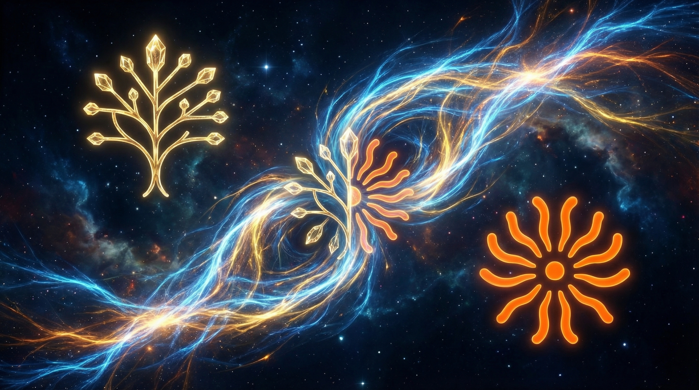

# Memory Graph Bridge




## 🌟 Overview

The **Memory Graph Bridge** is a specialized integration system designed to connect **Claude-Mem** (observation storage) with **Memora** (knowledge graph). This bridge enables seamless synchronization, visualization, and analysis of AI memory systems, creating a unified knowledge base that combines the structured logging of Claude-Mem with the graph capabilities of Memora.

> 🚀 **Goal**: Bridge the gap between linear observation logs and structured knowledge graphs.

## 🔗 Ecosystem References

This project serves as the connecting link between two powerful memory systems within the **DarKWinGTM Node Network**:

| System | Role | Function | Status |
|--------|------|----------|--------|
| **[Claude-Mem](https://github.com/DarKWinGTM/claude-mem)** | 🧠 **Short/Long-term Memory** | Logs observations, decisions, and task history in a linear, time-based format. |  |
| **[Memora](https://github.com/DarKWinGTM/memora)** | 🕸️ **Knowledge Graph** | Provides graph-based knowledge representation, typed relationships, and visualization capabilities. |  |

## 💡 Core Concepts

### 1. The Gap
- **Claude-Mem**: Excellent for logging "what happened" (Stream).
- **Memora**: Powerful for understanding "how things relate" (Graph).
- **The Bridge**: Connects these two systems to provide both historical context and structural understanding.

### 2. Solution Architecture
The system operates through a "Sync Bridge" that:
1.  📥 **Extracts** observations from Claude-Mem
2.  🔄 **Transforms** data into Memora-compatible format
3.  🔗 **Auto-links** related memories (Heuristic & Semantic)
4.  📊 **Exports** visualizations (Obsidian, vis.js, Mermaid)

## 🛠️ Implementation Approaches

This project offers two distinct implementation paths tailored to different needs:

### Path A: Full Bridge (Production)
- **Features**: CLI tools, custom Python API, advanced auto-linking, multiple export formats.
- **Best for**: Production systems, automated pipelines, large-scale graph analysis.

### Path B: Minimal Integration (Skill + Hook)
- **Features**: AI-driven analysis via Claude Code Skill (`/sync-memora`), hook-based auto-sync.
- **Best for**: Rapid setup, personal use, prototyping, leveraging AI reasoning for linking.

## 📂 Repository Structure

```tree
memory-graph-bridge/
├── README.md           # This file
├── img/                # Visual assets
│   └── image_*.png     # Concept visualization
└── skills/             # Prototype skills directory
    └── sync-memora/    # Ready-to-use sync skill
```

## 🚀 Getting Started

### Prerequisites
- Node.js ≥16
- Python ≥3.10
- Claude Code CLI

### Quick Setup (Minimal Mode)

1.  **Install Memora MCP**:
    Follow standard Memora installation instructions.

2.  **Install Skill**:
    ```bash
    mkdir -p ~/.claude/skills/sync-memora
    # Copy skill files from this repo
    cp skills/sync-memora/* ~/.claude/skills/sync-memora/
    ```

3.  **Run Sync**:
    In Claude Code:
    ```
    /sync-memora
    ```

## 👥 Contributors

Thanks to the following people who have contributed to this project:

<table>
  <tr>
    <td align="center">
      <a href="https://github.com/DarKWinGTM">
        
        <br />
        <sub><b>DarKWinGTM</b></sub>
      </a>
      <br />
      <a href="#maintenance" title="Maintenance">🚧</a>
      <a href="#content" title="Content">🖋️</a>
      <a href="#code" title="Code">💻</a>
    </td>
    <td align="center">
      <a href="https://anthropic.com">
        
        <br />
        <sub><b>Claude</b></sub>
      </a>
      <br />
      <a href="#design" title="Design">🎨</a>
      <a href="#code" title="Code">💻</a>
      <a href="#doc" title="Documentation">📖</a>
    </td>
  </tr>
</table>

## 📄 License

Distributed under the MIT License. See `LICENSE` for more information.

---
<div align="center">
  <p>Built with ❤️ by <a href="https://github.com/DarKWinGTM">DarKWinGTM</a></p>
</div>
