# Memory Graph Bridge


<div align="center">

  <a href="https://nodejs.org">
    
  </a>
  <a href="https://python.org">
    
  </a>
  <a href="https://anthropic.com">
    
  </a>
  <a href="https://modelcontextprotocol.io">
    
  </a>

</div>

## 🌟 Overview

The **Memory Graph Bridge** is a specialized integration system designed to connect **Claude-Mem** (observation storage) with **Memora** (knowledge graph). This bridge enables seamless synchronization, visualization, and analysis of AI memory systems, creating a unified knowledge base that combines the structured logging of Claude-Mem with the graph capabilities of Memora.

> 🚀 **Goal**: Bridge the gap between linear observation logs and structured knowledge graphs.

## 🔗 Ecosystem References

This project serves as the connecting link between two powerful memory systems within the **DarKWinGTM Node Network**:

| System | Role | Function | Status |
|--------|------|----------|--------|
| **[Claude-Mem](https://github.com/DarKWinGTM/claude-mem)** | 🧠 **Short/Long-term Memory** | Logs observations, decisions, and task history in a linear, time-based format. |  |
| **[Memora](https://github.com/agentic-mcp-tools/memora)** | 🕸️ **Knowledge Graph** | Provides graph-based knowledge representation, typed relationships, and visualization capabilities. |  |

## 💡 Core Concepts

### 1. The Gap
- **Claude-Mem**: Excellent for logging "what happened" (Stream).
- **Memora**: Powerful for understanding "how things relate" (Graph).
- **The Bridge**: Connects these two systems to provide both historical context and structural understanding.

### 2. Solution Architecture

```mermaid
flowchart LR
    subgraph Stream [Claude-Mem]
        direction TB
        Log[Observations Log]
        History[Chat History]
    end

    subgraph Bridge [Sync Bridge]
        Extract[📥 Extract] --> Transform[🔄 Transform]
        Transform --> Link[🔗 Auto-Link]
    end

    subgraph Graph [Memora]
        Knowledge[Knowledge Graph]
        Viz[Visualization]
    end

    Log --> Extract
    Link --> Knowledge
    Knowledge --> Viz

    style Stream fill:#f9f,stroke:#333,stroke-width:2px
    style Graph fill:#bbf,stroke:#333,stroke-width:2px
    style Bridge fill:#dfd,stroke:#333,stroke-width:2px
```



## 🛠️ Implementation Approaches

This project offers two distinct implementation paths tailored to different needs:

### Path A: Full Bridge (Production)
- **Features**: CLI tools, custom Python API, advanced auto-linking, multiple export formats.
- **Best for**: Production systems, automated pipelines, large-scale graph analysis.

### Path B: Minimal Integration (Skill + Hook)
- **Features**: AI-driven analysis via Claude Code Skill (`/sync-memora`), hook-based auto-sync.
- **Best for**: Rapid setup, personal use, prototyping, leveraging AI reasoning for linking.

## 📂 Repository Structure

```tree
memory-graph-bridge/
├── README.md           # This file
├── img/                # Visual assets
│   └── image_*.png     # Concept visualization
└── skills/             # Prototype skills directory
    └── sync-memora/    # Ready-to-use sync skill
```

## 🚀 Getting Started

### Prerequisites
- Node.js ≥16
- Python ≥3.10
- Claude Code CLI

### Quick Setup (Minimal Mode)

1.  **Install Memora MCP**:
    Follow standard Memora installation instructions.

2.  **Install Skill**:
    ```bash
    mkdir -p ~/.claude/skills/sync-memora
    # Copy skill files from this repo
    cp skills/sync-memora/* ~/.claude/skills/sync-memora/
    ```

3.  **Run Sync**:
    In Claude Code:
    ```
    /sync-memora
    ```

## 🗺️ Roadmap

- [x] **Phase 1: Concept & Design**
    - [x] Initial Architecture Design
    - [x] Skill Prototype (`/sync-memora`)
    - [x] Documentation & Repository Setup

- [ ] **Phase 2: Core Development**
    - [ ] Python-based Sync Engine
    - [ ] Semantic Analysis Module
    - [ ] CLI Tool (`mgb`)

- [ ] **Phase 3: Integration**
    - [ ] Obsidian Plugin
    - [ ] Automated Cron Sync
    - [ ] Web Visualization Dashboard

## 📄 License

Distributed under the MIT License. See `LICENSE` for more information.

---
<div align="center">
  <p>Built with ❤️ by <a href="https://github.com/DarKWinGTM">DarKWinGTM</a></p>
</div>
